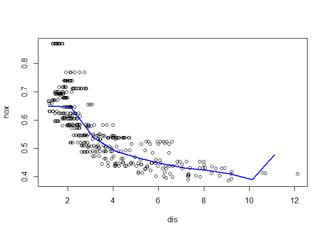
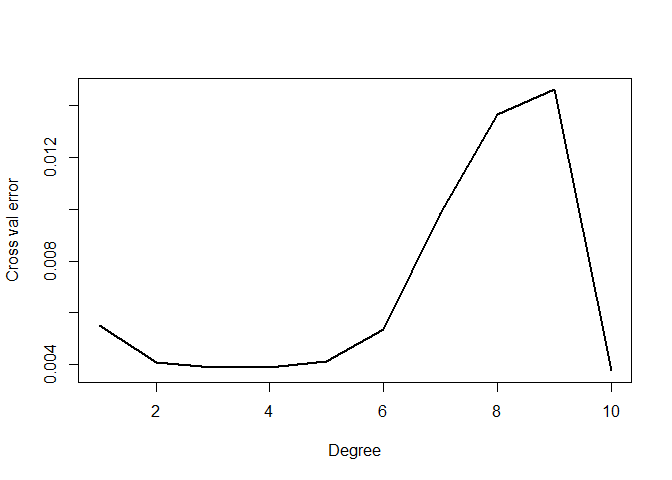
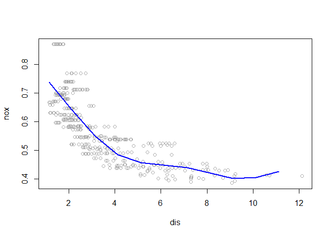
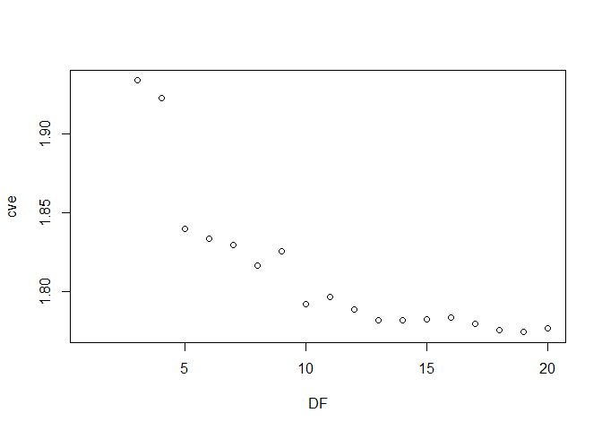
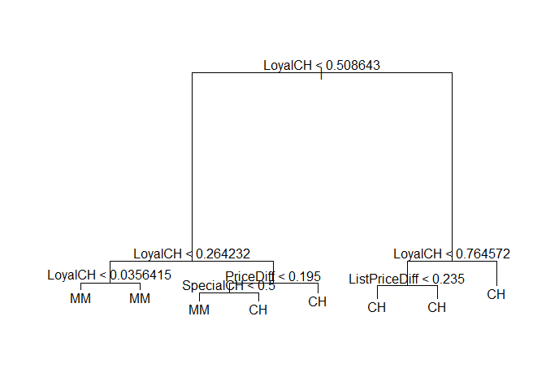
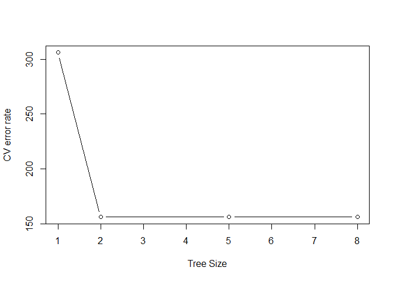

# PQHS 471 Hw 3
Kaylee Sarna  
April 10, 2018  

##Set-up


##Chapter 7 Exercise 9

9.


```r
library(MASS)
Boston=Boston
write.csv(Boston, "C:/Users/kaylee/Dropbox/stat 471/hw3/Boston.csv")
summary(Boston)
```

```
      crim                zn             indus            chas        
 Min.   : 0.00632   Min.   :  0.00   Min.   : 0.46   Min.   :0.00000  
 1st Qu.: 0.08204   1st Qu.:  0.00   1st Qu.: 5.19   1st Qu.:0.00000  
 Median : 0.25651   Median :  0.00   Median : 9.69   Median :0.00000  
 Mean   : 3.61352   Mean   : 11.36   Mean   :11.14   Mean   :0.06917  
 3rd Qu.: 3.67708   3rd Qu.: 12.50   3rd Qu.:18.10   3rd Qu.:0.00000  
 Max.   :88.97620   Max.   :100.00   Max.   :27.74   Max.   :1.00000  
      nox               rm             age              dis        
 Min.   :0.3850   Min.   :3.561   Min.   :  2.90   Min.   : 1.130  
 1st Qu.:0.4490   1st Qu.:5.886   1st Qu.: 45.02   1st Qu.: 2.100  
 Median :0.5380   Median :6.208   Median : 77.50   Median : 3.207  
 Mean   :0.5547   Mean   :6.285   Mean   : 68.57   Mean   : 3.795  
 3rd Qu.:0.6240   3rd Qu.:6.623   3rd Qu.: 94.08   3rd Qu.: 5.188  
 Max.   :0.8710   Max.   :8.780   Max.   :100.00   Max.   :12.127  
      rad              tax           ptratio          black       
 Min.   : 1.000   Min.   :187.0   Min.   :12.60   Min.   :  0.32  
 1st Qu.: 4.000   1st Qu.:279.0   1st Qu.:17.40   1st Qu.:375.38  
 Median : 5.000   Median :330.0   Median :19.05   Median :391.44  
 Mean   : 9.549   Mean   :408.2   Mean   :18.46   Mean   :356.67  
 3rd Qu.:24.000   3rd Qu.:666.0   3rd Qu.:20.20   3rd Qu.:396.23  
 Max.   :24.000   Max.   :711.0   Max.   :22.00   Max.   :396.90  
     lstat            medv      
 Min.   : 1.73   Min.   : 5.00  
 1st Qu.: 6.95   1st Qu.:17.02  
 Median :11.36   Median :21.20  
 Mean   :12.65   Mean   :22.53  
 3rd Qu.:16.95   3rd Qu.:25.00  
 Max.   :37.97   Max.   :50.00  
```

9.a.The regression output shows that each of the polynomial terms are significant due to such low p values.The plot shows that there is a smooth curve and it fits the data decently.


```r
attach(Boston)
#Fit cubic polynomial regression and regression output
fita = lm(nox ~ poly(dis, 3), data = Boston)
summary(fita)
```

```

Call:
lm(formula = nox ~ poly(dis, 3), data = Boston)

Residuals:
      Min        1Q    Median        3Q       Max 
-0.121130 -0.040619 -0.009738  0.023385  0.194904 

Coefficients:
               Estimate Std. Error t value Pr(>|t|)    
(Intercept)    0.554695   0.002759 201.021  < 2e-16 ***
poly(dis, 3)1 -2.003096   0.062071 -32.271  < 2e-16 ***
poly(dis, 3)2  0.856330   0.062071  13.796  < 2e-16 ***
poly(dis, 3)3 -0.318049   0.062071  -5.124 4.27e-07 ***
---
Signif. codes:  0 '***' 0.001 '**' 0.01 '*' 0.05 '.' 0.1 ' ' 1

Residual standard error: 0.06207 on 502 degrees of freedom
Multiple R-squared:  0.7148,	Adjusted R-squared:  0.7131 
F-statistic: 419.3 on 3 and 502 DF,  p-value: < 2.2e-16
```

```r
#Plot data and polynomial fits
disrange = range(dis)
dis.grid = seq(from = disrange[1], to = disrange[2])
preds = predict(fita, list(dis = dis.grid))
plot(nox ~ dis, data = Boston, col = "black")
lines(dis.grid, preds, col = "blue", lwd = 2)
```

<!-- -->

9.b. The plot looks similar to 9.a. The residual sum of squares decreases as the degree of polynomial increases from 1 to 10.


```r
#Plot polynomial fits 1 through 10
#Fit 10 polynomial regression and regression output
fitb = lm(nox ~ poly(dis, 10), data = Boston)

#Plot data and polynomial fits fro polynomial degree 10
disrangeb = range(dis)
dis.gridb = seq(from = disrangeb[1], to = disrangeb[2])
predsb = predict(fitb, list(dis = dis.gridb))
plot(nox ~ dis, data = Boston, col = "black")
lines(dis.gridb, predsb, col = "blue", lwd = 2)
```

<!-- -->

```r
#Report associated residual sum of squares
rsspoly10 = rep(NA, 10)
for (i in 1:10) {
    fitc = lm(nox ~ poly(dis, i), data = Boston)
    rsspoly10[i] = sum(fitc$residuals^2)
}
rsspoly10
```

```
 [1] 2.768563 2.035262 1.934107 1.932981 1.915290 1.878257 1.849484
 [8] 1.835630 1.833331 1.832171
```

9.c.A 20-fold cross-validation shows that the CV error decreases from 1-3 polynomial degrees then slowly increases as the polynomial degrees increase up to 10. I picked 3 as the best polynomial degree because the CV error is 0.00387 which is the lowest and therefore best polynomial degree. 4 is the second best polynomial degree with CV error of 0.00388.


```r
#Cross validation with K=20
library(boot)
```

```
Warning: package 'boot' was built under R version 3.4.3
```

```

Attaching package: 'boot'
```

```
The following object is masked from 'package:survival':

    aml
```

```
The following object is masked from 'package:lattice':

    melanoma
```

```r
crossv = rep(NA, 10)
for (i in 1:10) {
    logfit = glm(nox ~ poly(dis, i), data = Boston)
    crossv[i] = cv.glm(Boston, logfit, K = 20)$delta[2]
}
plot(1:10, crossv, xlab = "Degree", ylab = "Cross val error", type = "l", pch = 20, 
    lwd = 2)
```

<!-- -->

```r
crossv
```

```
 [1] 0.005512975 0.004070926 0.003864574 0.003868021 0.004130207
 [6] 0.005355433 0.009834731 0.013651335 0.014618679 0.003752693
```

9.d.I chose the knots 4,7, and 10 because dis has a range of 1-13. The 25th, 50th and 75th percentiles correspond roughly with 4,7 and 10.The output shows that all of the spline fits are significant from 1-6 due to very low p values and the adjusted R squared is 0.7151 which is fairly high and desirable in model fits.The plot shows a mostly smooth curve and fit with the data.


```r
range(dis)
```

```
[1]  1.1296 12.1265
```

```r
#Regression spline with 4 degrees of freedom 

library(splines)
fitd = lm(nox ~ bs(dis, df = 4, knots = c(4, 7, 10)), data = Boston)
summary(fitd)
```

```

Call:
lm(formula = nox ~ bs(dis, df = 4, knots = c(4, 7, 10)), data = Boston)

Residuals:
      Min        1Q    Median        3Q       Max 
-0.124592 -0.040324 -0.008719  0.024749  0.192906 

Coefficients:
                                      Estimate Std. Error t value Pr(>|t|)
(Intercept)                            0.73918    0.01332  55.510  < 2e-16
bs(dis, df = 4, knots = c(4, 7, 10))1 -0.08839    0.02506  -3.526  0.00046
bs(dis, df = 4, knots = c(4, 7, 10))2 -0.31363    0.01684 -18.625  < 2e-16
bs(dis, df = 4, knots = c(4, 7, 10))3 -0.27037    0.02791  -9.686  < 2e-16
bs(dis, df = 4, knots = c(4, 7, 10))4 -0.37989    0.03801  -9.995  < 2e-16
bs(dis, df = 4, knots = c(4, 7, 10))5 -0.28983    0.06615  -4.381 1.44e-05
bs(dis, df = 4, knots = c(4, 7, 10))6 -0.32971    0.06324  -5.214 2.71e-07
                                         
(Intercept)                           ***
bs(dis, df = 4, knots = c(4, 7, 10))1 ***
bs(dis, df = 4, knots = c(4, 7, 10))2 ***
bs(dis, df = 4, knots = c(4, 7, 10))3 ***
bs(dis, df = 4, knots = c(4, 7, 10))4 ***
bs(dis, df = 4, knots = c(4, 7, 10))5 ***
bs(dis, df = 4, knots = c(4, 7, 10))6 ***
---
Signif. codes:  0 '***' 0.001 '**' 0.01 '*' 0.05 '.' 0.1 ' ' 1

Residual standard error: 0.06185 on 499 degrees of freedom
Multiple R-squared:  0.7185,	Adjusted R-squared:  0.7151 
F-statistic: 212.3 on 6 and 499 DF,  p-value: < 2.2e-16
```

```r
#Plot the regression spline fit
predd = predict(fitd, list(dis = dis.grid))
plot(nox ~ dis, data = Boston, col = "darkgrey")
lines(dis.grid, predd, col = "blue", lwd = 2)
```

<!-- -->

9.e.The RSS decreases from 3 degrees of freedom to about 13 then increases from 14,15, and 16, then decreases again from 17-19 and increases at 20. Both mostly it is a decrease in RSS as degrees of freedom increases.


```r
#Regression spline for various degrees of freedom and RSS
cve = rep(NA, 20)
for (i in 3:20) {
    fite = lm(nox ~ bs(dis, df = i), data = Boston)
    cve[i] = sum(fite$residuals^2)
}
cve[-c(1, 2)]
```

```
 [1] 1.934107 1.922775 1.840173 1.833966 1.829884 1.816995 1.825653
 [8] 1.792535 1.796992 1.788999 1.782350 1.781838 1.782798 1.783546
[15] 1.779789 1.775838 1.774487 1.776727
```

```r
plot(cve,xlab="DF")
```

<!-- -->

9.f.I used a 20 fold cross validation to determine which degrees of freedom was best for the regression spline.I tested between degrees of freedom for 3 to 20.The cross validation error goes up and down occasionally as degrees of freedom increases. However, the lowest cross validation error is at 10 degrees of freedoml Since we want the the cross validation error to be low then 10 degrees of freedom is the best choice for the regression spline for this data.


```r
#Cross validation for best df for regression spline 20 fold
cvf = rep(NA, 20)
for (i in 3:20) {
    fitf = glm(nox ~ bs(dis, df = i), data = Boston)
    cvf[i] = cv.glm(Boston, fitf, K = 20)$delta[2]
}
```

```
Warning in bs(dis, degree = 3L, knots = numeric(0), Boundary.knots =
c(1.137, : some 'x' values beyond boundary knots may cause ill-conditioned
bases

Warning in bs(dis, degree = 3L, knots = numeric(0), Boundary.knots =
c(1.137, : some 'x' values beyond boundary knots may cause ill-conditioned
bases
```

```
Warning in bs(dis, degree = 3L, knots = numeric(0), Boundary.knots =
c(1.1296, : some 'x' values beyond boundary knots may cause ill-conditioned
bases

Warning in bs(dis, degree = 3L, knots = numeric(0), Boundary.knots =
c(1.1296, : some 'x' values beyond boundary knots may cause ill-conditioned
bases
```

```
Warning in bs(dis, degree = 3L, knots = structure(3.23925, .Names =
"50%"), : some 'x' values beyond boundary knots may cause ill-conditioned
bases

Warning in bs(dis, degree = 3L, knots = structure(3.23925, .Names =
"50%"), : some 'x' values beyond boundary knots may cause ill-conditioned
bases
```

```
Warning in bs(dis, degree = 3L, knots = structure(3.23925, .Names =
"50%"), : some 'x' values beyond boundary knots may cause ill-conditioned
bases

Warning in bs(dis, degree = 3L, knots = structure(3.23925, .Names =
"50%"), : some 'x' values beyond boundary knots may cause ill-conditioned
bases
```

```
Warning in bs(dis, degree = 3L, knots = structure(c(2.38876666666667,
4.25576666666667: some 'x' values beyond boundary knots may cause ill-
conditioned bases

Warning in bs(dis, degree = 3L, knots = structure(c(2.38876666666667,
4.25576666666667: some 'x' values beyond boundary knots may cause ill-
conditioned bases
```

```
Warning in bs(dis, degree = 3L, knots = structure(c(2.3889, 4.3549), .Names
= c("33.33333%", : some 'x' values beyond boundary knots may cause ill-
conditioned bases

Warning in bs(dis, degree = 3L, knots = structure(c(2.3889, 4.3549), .Names
= c("33.33333%", : some 'x' values beyond boundary knots may cause ill-
conditioned bases
```

```
Warning in bs(dis, degree = 3L, knots = structure(c(2.0869, 3.1323, 5.2119:
some 'x' values beyond boundary knots may cause ill-conditioned bases

Warning in bs(dis, degree = 3L, knots = structure(c(2.0869, 3.1323, 5.2119:
some 'x' values beyond boundary knots may cause ill-conditioned bases
```

```
Warning in bs(dis, degree = 3L, knots = structure(c(2.1069, 3.1992, 5.118:
some 'x' values beyond boundary knots may cause ill-conditioned bases

Warning in bs(dis, degree = 3L, knots = structure(c(2.1069, 3.1992, 5.118:
some 'x' values beyond boundary knots may cause ill-conditioned bases
```

```
Warning in bs(dis, degree = 3L, knots = structure(c(1.9512, 2.59766,
3.86392, : some 'x' values beyond boundary knots may cause ill-conditioned
bases

Warning in bs(dis, degree = 3L, knots = structure(c(1.9512, 2.59766,
3.86392, : some 'x' values beyond boundary knots may cause ill-conditioned
bases
```

```
Warning in bs(dis, degree = 3L, knots = structure(c(1.85738333333333,
2.38636666666667, : some 'x' values beyond boundary knots may cause ill-
conditioned bases

Warning in bs(dis, degree = 3L, knots = structure(c(1.85738333333333,
2.38636666666667, : some 'x' values beyond boundary knots may cause ill-
conditioned bases
```

```
Warning in bs(dis, degree = 3L, knots = structure(c(1.8681, 2.3889,
3.2157, : some 'x' values beyond boundary knots may cause ill-conditioned
bases

Warning in bs(dis, degree = 3L, knots = structure(c(1.8681, 2.3889,
3.2157, : some 'x' values beyond boundary knots may cause ill-conditioned
bases
```

```
Warning in bs(dis, degree = 3L, knots = structure(c(1.78475714285714,
2.16775714285714, : some 'x' values beyond boundary knots may cause ill-
conditioned bases

Warning in bs(dis, degree = 3L, knots = structure(c(1.78475714285714,
2.16775714285714, : some 'x' values beyond boundary knots may cause ill-
conditioned bases
```

```
Warning in bs(dis, degree = 3L, knots = structure(c(1.7924,
2.20005714285714, : some 'x' values beyond boundary knots may cause ill-
conditioned bases

Warning in bs(dis, degree = 3L, knots = structure(c(1.7924,
2.20005714285714, : some 'x' values beyond boundary knots may cause ill-
conditioned bases
```

```
Warning in bs(dis, degree = 3L, knots = structure(c(1.7494, 2.1, 2.5182, :
some 'x' values beyond boundary knots may cause ill-conditioned bases

Warning in bs(dis, degree = 3L, knots = structure(c(1.7494, 2.1, 2.5182, :
some 'x' values beyond boundary knots may cause ill-conditioned bases
```

```
Warning in bs(dis, degree = 3L, knots = structure(c(1.7550125, 2.102875, :
some 'x' values beyond boundary knots may cause ill-conditioned bases

Warning in bs(dis, degree = 3L, knots = structure(c(1.7550125, 2.102875, :
some 'x' values beyond boundary knots may cause ill-conditioned bases
```

```
Warning in bs(dis, degree = 3L, knots = structure(c(1.6931, 2.0058,
2.3817, : some 'x' values beyond boundary knots may cause ill-conditioned
bases

Warning in bs(dis, degree = 3L, knots = structure(c(1.6931, 2.0058,
2.3817, : some 'x' values beyond boundary knots may cause ill-conditioned
bases
```

```
Warning in bs(dis, degree = 3L, knots = structure(c(1.71043333333333,
2.0058, : some 'x' values beyond boundary knots may cause ill-conditioned
bases

Warning in bs(dis, degree = 3L, knots = structure(c(1.71043333333333,
2.0058, : some 'x' values beyond boundary knots may cause ill-conditioned
bases
```

```
Warning in bs(dis, degree = 3L, knots = structure(c(1.62422, 1.94576,
2.25686, : some 'x' values beyond boundary knots may cause ill-conditioned
bases

Warning in bs(dis, degree = 3L, knots = structure(c(1.62422, 1.94576,
2.25686, : some 'x' values beyond boundary knots may cause ill-conditioned
bases
```

```
Warning in bs(dis, degree = 3L, knots = structure(c(1.618, 1.9301,
2.2004, : some 'x' values beyond boundary knots may cause ill-conditioned
bases

Warning in bs(dis, degree = 3L, knots = structure(c(1.618, 1.9301,
2.2004, : some 'x' values beyond boundary knots may cause ill-conditioned
bases
```

```
Warning in bs(dis, degree = 3L, knots = structure(c(1.61260909090909,
1.90514545454545, : some 'x' values beyond boundary knots may cause ill-
conditioned bases

Warning in bs(dis, degree = 3L, knots = structure(c(1.61260909090909,
1.90514545454545, : some 'x' values beyond boundary knots may cause ill-
conditioned bases
```

```
Warning in bs(dis, degree = 3L, knots = structure(c(1.60165454545455,
1.89808181818182, : some 'x' values beyond boundary knots may cause ill-
conditioned bases

Warning in bs(dis, degree = 3L, knots = structure(c(1.60165454545455,
1.89808181818182, : some 'x' values beyond boundary knots may cause ill-
conditioned bases
```

```
Warning in bs(dis, degree = 3L, knots = structure(c(1.5895, 1.8662,
2.1069, : some 'x' values beyond boundary knots may cause ill-conditioned
bases

Warning in bs(dis, degree = 3L, knots = structure(c(1.5895, 1.8662,
2.1069, : some 'x' values beyond boundary knots may cause ill-conditioned
bases
```

```
Warning in bs(dis, degree = 3L, knots = structure(c(1.5804, 1.8226,
2.0882, : some 'x' values beyond boundary knots may cause ill-conditioned
bases

Warning in bs(dis, degree = 3L, knots = structure(c(1.5804, 1.8226,
2.0882, : some 'x' values beyond boundary knots may cause ill-conditioned
bases
```

```
Warning in bs(dis, degree = 3L, knots = structure(c(1.5523,
1.81914615384615, : some 'x' values beyond boundary knots may cause ill-
conditioned bases

Warning in bs(dis, degree = 3L, knots = structure(c(1.5523,
1.81914615384615, : some 'x' values beyond boundary knots may cause ill-
conditioned bases
```

```
Warning in bs(dis, degree = 3L, knots = structure(c(1.57991538461538,
1.81647692307692, : some 'x' values beyond boundary knots may cause ill-
conditioned bases

Warning in bs(dis, degree = 3L, knots = structure(c(1.57991538461538,
1.81647692307692, : some 'x' values beyond boundary knots may cause ill-
conditioned bases
```

```
Warning in bs(dis, degree = 3L, knots = structure(c(1.53085,
1.79037142857143, : some 'x' values beyond boundary knots may cause ill-
conditioned bases

Warning in bs(dis, degree = 3L, knots = structure(c(1.53085,
1.79037142857143, : some 'x' values beyond boundary knots may cause ill-
conditioned bases
```

```
Warning in bs(dis, degree = 3L, knots = structure(c(1.52825,
1.77864285714286, : some 'x' values beyond boundary knots may cause ill-
conditioned bases

Warning in bs(dis, degree = 3L, knots = structure(c(1.52825,
1.77864285714286, : some 'x' values beyond boundary knots may cause ill-
conditioned bases
```

```
Warning in bs(dis, degree = 3L, knots = structure(c(1.52764,
1.75844666666667, : some 'x' values beyond boundary knots may cause ill-
conditioned bases

Warning in bs(dis, degree = 3L, knots = structure(c(1.52764,
1.75844666666667, : some 'x' values beyond boundary knots may cause ill-
conditioned bases
```

```
Warning in bs(dis, degree = 3L, knots = structure(c(1.51914666666667,
1.75728666666667, : some 'x' values beyond boundary knots may cause ill-
conditioned bases

Warning in bs(dis, degree = 3L, knots = structure(c(1.51914666666667,
1.75728666666667, : some 'x' values beyond boundary knots may cause ill-
conditioned bases
```

```
Warning in bs(dis, degree = 3L, knots = structure(c(1.5182875, 1.7443625, :
some 'x' values beyond boundary knots may cause ill-conditioned bases

Warning in bs(dis, degree = 3L, knots = structure(c(1.5182875, 1.7443625, :
some 'x' values beyond boundary knots may cause ill-conditioned bases
```

```
Warning in bs(dis, degree = 3L, knots = structure(c(1.51845, 1.7529125, :
some 'x' values beyond boundary knots may cause ill-conditioned bases

Warning in bs(dis, degree = 3L, knots = structure(c(1.51845, 1.7529125, :
some 'x' values beyond boundary knots may cause ill-conditioned bases
```

```
Warning in bs(dis, degree = 3L, knots = structure(c(1.49150588235294,
1.72654705882353, : some 'x' values beyond boundary knots may cause ill-
conditioned bases

Warning in bs(dis, degree = 3L, knots = structure(c(1.49150588235294,
1.72654705882353, : some 'x' values beyond boundary knots may cause ill-
conditioned bases
```

```
Warning in bs(dis, degree = 3L, knots = structure(c(1.51201176470588,
1.74733529411765, : some 'x' values beyond boundary knots may cause ill-
conditioned bases

Warning in bs(dis, degree = 3L, knots = structure(c(1.51201176470588,
1.74733529411765, : some 'x' values beyond boundary knots may cause ill-
conditioned bases
```

```
Warning in bs(dis, degree = 3L, knots = structure(c(1.5072, 1.6714,
1.8589, : some 'x' values beyond boundary knots may cause ill-conditioned
bases

Warning in bs(dis, degree = 3L, knots = structure(c(1.5072, 1.6714,
1.8589, : some 'x' values beyond boundary knots may cause ill-conditioned
bases
```

```
Warning in bs(dis, degree = 3L, knots = structure(c(1.51426666666667,
1.70788888888889, : some 'x' values beyond boundary knots may cause ill-
conditioned bases

Warning in bs(dis, degree = 3L, knots = structure(c(1.51426666666667,
1.70788888888889, : some 'x' values beyond boundary knots may cause ill-
conditioned bases
```

```r
cvf
```

```
 [1]          NA          NA 0.003864196 0.003888274 0.003701579
 [6] 0.003709345 0.003733852 0.003713630 0.003728921 0.003711075
[11] 0.003719655 0.003719488 0.003717038 0.003729679 0.003755833
[16] 0.003736580 0.003784885 0.003738545 0.003828821 0.003817318
```


##Chapter 8 Exercise 9

9.

```r
library(ISLR)
OJ=OJ
write.csv(OJ, "C:/Users/kaylee/Dropbox/stat 471/hw3/OJ.csv")
summary(OJ)
```

```
 Purchase WeekofPurchase     StoreID        PriceCH         PriceMM     
 CH:653   Min.   :227.0   Min.   :1.00   Min.   :1.690   Min.   :1.690  
 MM:417   1st Qu.:240.0   1st Qu.:2.00   1st Qu.:1.790   1st Qu.:1.990  
          Median :257.0   Median :3.00   Median :1.860   Median :2.090  
          Mean   :254.4   Mean   :3.96   Mean   :1.867   Mean   :2.085  
          3rd Qu.:268.0   3rd Qu.:7.00   3rd Qu.:1.990   3rd Qu.:2.180  
          Max.   :278.0   Max.   :7.00   Max.   :2.090   Max.   :2.290  
     DiscCH            DiscMM         SpecialCH        SpecialMM     
 Min.   :0.00000   Min.   :0.0000   Min.   :0.0000   Min.   :0.0000  
 1st Qu.:0.00000   1st Qu.:0.0000   1st Qu.:0.0000   1st Qu.:0.0000  
 Median :0.00000   Median :0.0000   Median :0.0000   Median :0.0000  
 Mean   :0.05186   Mean   :0.1234   Mean   :0.1477   Mean   :0.1617  
 3rd Qu.:0.00000   3rd Qu.:0.2300   3rd Qu.:0.0000   3rd Qu.:0.0000  
 Max.   :0.50000   Max.   :0.8000   Max.   :1.0000   Max.   :1.0000  
    LoyalCH          SalePriceMM     SalePriceCH      PriceDiff      
 Min.   :0.000011   Min.   :1.190   Min.   :1.390   Min.   :-0.6700  
 1st Qu.:0.325257   1st Qu.:1.690   1st Qu.:1.750   1st Qu.: 0.0000  
 Median :0.600000   Median :2.090   Median :1.860   Median : 0.2300  
 Mean   :0.565782   Mean   :1.962   Mean   :1.816   Mean   : 0.1465  
 3rd Qu.:0.850873   3rd Qu.:2.130   3rd Qu.:1.890   3rd Qu.: 0.3200  
 Max.   :0.999947   Max.   :2.290   Max.   :2.090   Max.   : 0.6400  
 Store7      PctDiscMM        PctDiscCH       ListPriceDiff  
 No :714   Min.   :0.0000   Min.   :0.00000   Min.   :0.000  
 Yes:356   1st Qu.:0.0000   1st Qu.:0.00000   1st Qu.:0.140  
           Median :0.0000   Median :0.00000   Median :0.240  
           Mean   :0.0593   Mean   :0.02731   Mean   :0.218  
           3rd Qu.:0.1127   3rd Qu.:0.00000   3rd Qu.:0.300  
           Max.   :0.4020   Max.   :0.25269   Max.   :0.440  
     STORE      
 Min.   :0.000  
 1st Qu.:0.000  
 Median :2.000  
 Mean   :1.631  
 3rd Qu.:3.000  
 Max.   :4.000  
```

9.a.I created a training set with 800 observations using the OJ data from ISLR package. A test set was created with the remaining 270 observations from the OJ data.


```r
#Training and test set creation
attach(OJ)
set.seed(1)

train = sample(dim(OJ)[1], 800)
OJ_train = OJ[train, ]
OJ_test = OJ[-train, ]
```

9.b. The variables that were used in tree construction were LoyalCH, PriceDiff, SpecialCH, and ListPriceDiff.The number of terminal nodes was 8. The training error rate or misclassification error rate was 0.165.


```r
#Fit tree to Oj training data with Purchase as response
library(tree)
```

```
Warning: package 'tree' was built under R version 3.4.3
```

```r
ojtree1 = tree(Purchase ~ ., data = OJ_train)
summary(ojtree1)
```

```

Classification tree:
tree(formula = Purchase ~ ., data = OJ_train)
Variables actually used in tree construction:
[1] "LoyalCH"       "PriceDiff"     "SpecialCH"     "ListPriceDiff"
Number of terminal nodes:  8 
Residual mean deviance:  0.7305 = 578.6 / 792 
Misclassification error rate: 0.165 = 132 / 800 
```

9.c. There is a terminal node labeled "8)" and this is known due to the asterisk in the output.The splitting variable at node "8)" is LoyalCH and the splitting value is 0.0356415.There are 57 observations in this branch.The deviance is 10.07.The prediction at this node for Purchase is MM.0.01754 About 1.8% points in this node have CH as the value for Purchase.About 98.2% of points in this node have MM as the value for Purchase.


```r
#Detailed tree object and terminal node analysis
ojtree1
```

```
node), split, n, deviance, yval, (yprob)
      * denotes terminal node

 1) root 800 1064.00 CH ( 0.61750 0.38250 )  
   2) LoyalCH < 0.508643 350  409.30 MM ( 0.27143 0.72857 )  
     4) LoyalCH < 0.264232 166  122.10 MM ( 0.12048 0.87952 )  
       8) LoyalCH < 0.0356415 57   10.07 MM ( 0.01754 0.98246 ) *
       9) LoyalCH > 0.0356415 109  100.90 MM ( 0.17431 0.82569 ) *
     5) LoyalCH > 0.264232 184  248.80 MM ( 0.40761 0.59239 )  
      10) PriceDiff < 0.195 83   91.66 MM ( 0.24096 0.75904 )  
        20) SpecialCH < 0.5 70   60.89 MM ( 0.15714 0.84286 ) *
        21) SpecialCH > 0.5 13   16.05 CH ( 0.69231 0.30769 ) *
      11) PriceDiff > 0.195 101  139.20 CH ( 0.54455 0.45545 ) *
   3) LoyalCH > 0.508643 450  318.10 CH ( 0.88667 0.11333 )  
     6) LoyalCH < 0.764572 172  188.90 CH ( 0.76163 0.23837 )  
      12) ListPriceDiff < 0.235 70   95.61 CH ( 0.57143 0.42857 ) *
      13) ListPriceDiff > 0.235 102   69.76 CH ( 0.89216 0.10784 ) *
     7) LoyalCH > 0.764572 278   86.14 CH ( 0.96403 0.03597 ) *
```

9.d.LoyalCH is the most common and important variable in the tree since it is in the top three nodes. If LoyalCH greater than (>) 0.764572 than the tree predicts CH as the purchase.Then there are intermediate values for LoyalCH. If LoyalCH < 0.764572 and ListPriceDiff is either < or > 0.235 then the tree predicts CH as the purchase. If LoyalCH >0.264232 and PriceDiff >=0.195 then the tree predicts CH as the purchase. If LoyalCH > 0.264232 and PriceDiff < 0.195 and SpecialCH >= 0.5 then the tree predicts CH and predicts MM if SpecialCH <0.5. If LoyalCH is <0.264232 and Loyal CH is either < or >= to 0.0356415 then the tree predicts MM as purchase.


```r
#Plot tree and interpret
plot(ojtree1)
text(ojtree1,pretty=0)
```

<!-- -->

9.e.The test error rate is (49+12)/270=0.2259. So using this approach about 22.59% of the purchases are predicted incorrectly and correct predictions occur for about 77.41% of purchases. The test error rate is 0.2259.


```r
#Predict response on test data and produce confusion matrix 
predoj = predict(ojtree1, OJ_test, type = "class")
table(OJ_test$Purchase, predoj)
```

```
    predoj
      CH  MM
  CH 147  12
  MM  49  62
```

```r
#Test error rate
(49+12)/270
```

```
[1] 0.2259259
```

9.f.The tree with 5 terminal nodes has the lowest cross validation error rate. This suggests 5 terminal nodes might be optimal.


```r
#CV tree function applied
ojcv = cv.tree(ojtree1, FUN = prune.misclass)
ojcv
```

```
$size
[1] 8 5 2 1

$dev
[1] 156 156 156 306

$k
[1]       -Inf   0.000000   4.666667 160.000000

$method
[1] "misclass"

attr(,"class")
[1] "prune"         "tree.sequence"
```

9.g.The plot gives CV error rates for each tree size in the OJ data.Tree size 5 looks to have the lowest CV error rate.


```r
#Plot with tree size and cv error rate
plot(ojcv$size, ojcv$dev, type = "b", xlab = "Tree Size", ylab = "CV error rate")
```

<!-- -->

9.h.The tree with 5 terminal nodes has the lowest cross validation error rate based on both the output from ojcv and the resulting plot.

9.i.I produced a pruned tree with 5 terminal nodes based on the question's directions and the results from cross-validation earlier.


```r
#Pruned tree with cross-validation
pruneoj = prune.misclass(ojtree1, best = 5)
```

9.j.The misclassification error rate or training error rate is exactly the same in the pruned and unpruned trees. It is 0.165.


```r
#Compare training error rates in pruned and unpruned trees
summary(ojtree1)
```

```

Classification tree:
tree(formula = Purchase ~ ., data = OJ_train)
Variables actually used in tree construction:
[1] "LoyalCH"       "PriceDiff"     "SpecialCH"     "ListPriceDiff"
Number of terminal nodes:  8 
Residual mean deviance:  0.7305 = 578.6 / 792 
Misclassification error rate: 0.165 = 132 / 800 
```

```r
summary(pruneoj)
```

```

Classification tree:
snip.tree(tree = ojtree1, nodes = 3:4)
Variables actually used in tree construction:
[1] "LoyalCH"   "PriceDiff" "SpecialCH"
Number of terminal nodes:  5 
Residual mean deviance:  0.8256 = 656.4 / 795 
Misclassification error rate: 0.165 = 132 / 800 
```

9.k.The test error rate is the same in both the pruned and unpruned trees. The test error rate is 0.2259259.


```r
#Unpruned test error rate
unprunedpred = predict(ojtree1, OJ_test, type = "class")
unprunedtesterror = sum(OJ_test$Purchase != unprunedpred)
unprunedtesterror/length(unprunedpred)
```

```
[1] 0.2259259
```

```r
#Pruned test error rate
prunedpred = predict(pruneoj, OJ_test, type = "class")
prunedtesterror = sum(OJ_test$Purchase != prunedpred)
prunedtesterror/length(prunedpred)
```

```
[1] 0.2259259
```

##Chapter 8 Khan data question


I found this question really difficult. Everything I tried slowed my computer down and made it freeze. Also, I tried to use code modified from the book and class notes but did not have much luck. Here are some of my attempts.
Set-up Khan data
library(ISLR)
khan=khan


Khanytrain=Khan$ytrain
write.csv(Khanytrain, "C:/Users/kaylee/Dropbox/stat 471/hw3/Khanytrain.csv")


Make Khan xtrain main train data and give id to merge with ytrain.

Khantrain=Khan$xtrain
Khantrain$id<-(1:63)

Give id column to ytrain
Khanytrain=Khan$ytrain
Khanytrain$id<-(1:63)

Rename x to tumor in ytrain and ytest
library(plyr)
rename(Khanytrain, c("x"="tumor"))

Merge data
Khantrain1<-merge(Khantrain,Khanytrain)

Merge xtest and ytest
Make Khan xtest main test data and give id to merge with ytest.
Khantest=Khan$xtest
Khantest$id<-(1:63)

Give id column to ytrain
Khanytest=Khan$ytest
Khanytest$id<-(1:63)

Rename x to tumor in ytrain and ytest
library(plyr)
rename(Khanytest, c("x"="tumor"))

Merge data
Khantest1<-merge(Khantest,Khanytest)


set.seed(1)
library(randomForest)
rf.khantrain= randomForest(tumor∼.,data=Khantrain1 ,
mtry=382, importance =TRUE)
yhat.rf = predict(rf.khantrain ,newdata=Khantest1)
mean((yhat.rf-Khantest1)^2)


```r
library(dendextend)
```

```
Warning: package 'dendextend' was built under R version 3.4.4
```

```

---------------------
Welcome to dendextend version 1.7.0
Type citation('dendextend') for how to cite the package.

Type browseVignettes(package = 'dendextend') for the package vignette.
The github page is: https://github.com/talgalili/dendextend/

Suggestions and bug-reports can be submitted at: https://github.com/talgalili/dendextend/issues
Or contact: <tal.galili@gmail.com>

	To suppress this message use:  suppressPackageStartupMessages(library(dendextend))
---------------------
```

```

Attaching package: 'dendextend'
```

```
The following object is masked from 'package:stats':

    cutree
```

```r
khan=khan
khantrain=khan$train
khantest=khan$test
```

Since there are 64 variables in khantrain I took the square root of 64 and got 8. I used this for my mtry value.

library(randomForest)
set.seed(1)
rf.khan= randomForest(EWS.T1∼.,data=khantrain , 
mtry=8, importance =TRUE)
yhat.rf = predict(rf.khan ,newdata=khantest)
mean((yhat.rf-khan.test)^2)


##Chapter 9 Exercise 8

8.

```r
library(ISLR)
OJ=OJ
write.csv(OJ, "C:/Users/kaylee/Dropbox/stat 471/hw3/OJ.csv")
summary(OJ)
```

```
 Purchase WeekofPurchase     StoreID        PriceCH         PriceMM     
 CH:653   Min.   :227.0   Min.   :1.00   Min.   :1.690   Min.   :1.690  
 MM:417   1st Qu.:240.0   1st Qu.:2.00   1st Qu.:1.790   1st Qu.:1.990  
          Median :257.0   Median :3.00   Median :1.860   Median :2.090  
          Mean   :254.4   Mean   :3.96   Mean   :1.867   Mean   :2.085  
          3rd Qu.:268.0   3rd Qu.:7.00   3rd Qu.:1.990   3rd Qu.:2.180  
          Max.   :278.0   Max.   :7.00   Max.   :2.090   Max.   :2.290  
     DiscCH            DiscMM         SpecialCH        SpecialMM     
 Min.   :0.00000   Min.   :0.0000   Min.   :0.0000   Min.   :0.0000  
 1st Qu.:0.00000   1st Qu.:0.0000   1st Qu.:0.0000   1st Qu.:0.0000  
 Median :0.00000   Median :0.0000   Median :0.0000   Median :0.0000  
 Mean   :0.05186   Mean   :0.1234   Mean   :0.1477   Mean   :0.1617  
 3rd Qu.:0.00000   3rd Qu.:0.2300   3rd Qu.:0.0000   3rd Qu.:0.0000  
 Max.   :0.50000   Max.   :0.8000   Max.   :1.0000   Max.   :1.0000  
    LoyalCH          SalePriceMM     SalePriceCH      PriceDiff      
 Min.   :0.000011   Min.   :1.190   Min.   :1.390   Min.   :-0.6700  
 1st Qu.:0.325257   1st Qu.:1.690   1st Qu.:1.750   1st Qu.: 0.0000  
 Median :0.600000   Median :2.090   Median :1.860   Median : 0.2300  
 Mean   :0.565782   Mean   :1.962   Mean   :1.816   Mean   : 0.1465  
 3rd Qu.:0.850873   3rd Qu.:2.130   3rd Qu.:1.890   3rd Qu.: 0.3200  
 Max.   :0.999947   Max.   :2.290   Max.   :2.090   Max.   : 0.6400  
 Store7      PctDiscMM        PctDiscCH       ListPriceDiff  
 No :714   Min.   :0.0000   Min.   :0.00000   Min.   :0.000  
 Yes:356   1st Qu.:0.0000   1st Qu.:0.00000   1st Qu.:0.140  
           Median :0.0000   Median :0.00000   Median :0.240  
           Mean   :0.0593   Mean   :0.02731   Mean   :0.218  
           3rd Qu.:0.1127   3rd Qu.:0.00000   3rd Qu.:0.300  
           Max.   :0.4020   Max.   :0.25269   Max.   :0.440  
     STORE      
 Min.   :0.000  
 1st Qu.:0.000  
 Median :2.000  
 Mean   :1.631  
 3rd Qu.:3.000  
 Max.   :4.000  
```

8.a.I created a training set with 800 observations using the OJ data from ISLR package. A test set was created with the remaining 270 observations from the OJ data.


```r
#Training and test set creation
attach(OJ)
```

```
The following objects are masked from OJ (pos = 5):

    DiscCH, DiscMM, ListPriceDiff, LoyalCH, PctDiscCH, PctDiscMM,
    PriceCH, PriceDiff, PriceMM, Purchase, SalePriceCH,
    SalePriceMM, SpecialCH, SpecialMM, STORE, Store7, StoreID,
    WeekofPurchase
```

```r
set.seed(2)

train = sample(dim(OJ)[1], 800)
OJ.train = OJ[train, ]
OJ.test = OJ[-train, ]
```

8.b.When a support vector classifier was fit to the training data a summary was obtained. There were 440 support vectors out of the 800 points.The cost was 0.01 and there were two classes. Of the 440 support vectors, 220 of them were CH and the other 220 were MM.The SVM-type was a C-classification.


```r
#Fit support vector classifier
library(e1071)
```

```
Warning: package 'e1071' was built under R version 3.4.3
```

```

Attaching package: 'e1071'
```

```
The following object is masked from 'package:simputation':

    impute
```

```
The following object is masked from 'package:Hmisc':

    impute
```

```r
svm1 = svm(Purchase ~ ., kernel = "linear", data = OJ.train, cost = 0.01)
summary(svm1)
```

```

Call:
svm(formula = Purchase ~ ., data = OJ.train, kernel = "linear", 
    cost = 0.01)


Parameters:
   SVM-Type:  C-classification 
 SVM-Kernel:  linear 
       cost:  0.01 
      gamma:  0.05555556 

Number of Support Vectors:  440

 ( 220 220 )


Number of Classes:  2 

Levels: 
 CH MM
```

8.c.The training error rate is 18% or 0.18 and the test error rate is 14.07% or 0.1407407.


```r
#Training error rate
predtrain8c = predict(svm1, OJ.train)
table(OJ.train$Purchase, predtrain8c)
```

```
    predtrain8c
      CH  MM
  CH 419  61
  MM  83 237
```

```r
(83+61)/(419+61+83+237)
```

```
[1] 0.18
```

```r
#Test error rate
predtest8c=predict(svm1,OJ.test)
table(OJ.test$Purchase,predtest8c)
```

```
    predtest8c
      CH  MM
  CH 156  17
  MM  21  76
```

```r
(21+17)/(156+17+21+76)
```

```
[1] 0.1407407
```

8.d.I selected a range of values from 0.01 - 10. Then I chose the optimal cost from the values I included in my range. The optimal cost is 6.0 because the error was lowest in this number from the selected numbers in my range.


```r
#tune function
set.seed(2)
tune.out = tune(svm, Purchase ~ ., data = OJ.train, kernel = "linear", ranges = list(cost = c(0.01, 0.5, 2,4,6,8,10)))
summary(tune.out)
```

```

Parameter tuning of 'svm':

- sampling method: 10-fold cross validation 

- best parameters:
 cost
    6

- best performance: 0.17625 

- Detailed performance results:
   cost   error dispersion
1  0.01 0.18625 0.05935124
2  0.50 0.17875 0.05653477
3  2.00 0.17875 0.05466120
4  4.00 0.17750 0.05857094
5  6.00 0.17625 0.05846711
6  8.00 0.18000 0.05596378
7 10.00 0.18125 0.05344065
```

8.e. The training error with cost=6.00 is 0.1675 or 16.75%.The test error with cost = 6.00 is 0.1296296.The training error decreased using this optimal cost from 18% to 16.75%. The test error also decreased using this optimal cost from 14.07% to about 13%.


```r
#Training error with cost 6
svm8e = svm(Purchase ~ ., kernel = "linear", data = OJ.train, cost = tune.out$best.parameters$cost)
predtrain8e = predict(svm8e, OJ.train)
table(OJ.train$Purchase, predtrain8e)
```

```
    predtrain8e
      CH  MM
  CH 421  59
  MM  75 245
```

```r
(75+59)/(421+59+75+245)
```

```
[1] 0.1675
```

```r
#Test error
predtest = predict(svm8e, OJ.test)
table(OJ.test$Purchase, predtest)
```

```
    predtest
      CH  MM
  CH 155  18
  MM  17  80
```

```r
(17+18)/(155+18+17+80)
```

```
[1] 0.1296296
```

8.f. Repeat-b=That there were 372 support vectors out of the 800 points.There were two classes. Of the 372 support vectors, 189 of them were CH and the other 183 were MM.The SVM-type was a C-classification.

Repeat-stepc=The training error rate for the classifier is 0.155 or 15.5% and a test error rate of about 0.17 or 17%.

Repeat-step d =I selected a range of values from 0.01 - 10. Then I chose the optimal cost from the values I included in my range. The optimal cost is 4.0 because the error was lowest in this number from the selected numbers in my range.

Repeat-step e=The training error with cost=4.00 is 0.145 or 14.5%.The test error with cost = 4.00 is 0.1889.The training error decreased using this optimal cost from 15.5% to 14.5%. The test error increased using this optimal cost from 17% to about 18.9%. The training error is better with radial kernal but the test error is worse with radial kernal.


```r
#Support vector machine with radial kernal and default gamma
#Steps from b
set.seed(1)
radial = svm(Purchase ~ ., data = OJ.train, kernel = "radial")
summary(radial)
```

```

Call:
svm(formula = Purchase ~ ., data = OJ.train, kernel = "radial")


Parameters:
   SVM-Type:  C-classification 
 SVM-Kernel:  radial 
       cost:  1 
      gamma:  0.05555556 

Number of Support Vectors:  372

 ( 189 183 )


Number of Classes:  2 

Levels: 
 CH MM
```

```r
##step c
#Training error rate
predtrain8f = predict(radial, OJ.train)
table(OJ.train$Purchase, predtrain8f)
```

```
    predtrain8f
      CH  MM
  CH 440  40
  MM  84 236
```

```r
(84+40)/(440+40+84+236)
```

```
[1] 0.155
```

```r
#Test error rate
predtest8f=predict(radial,OJ.test)
table(OJ.test$Purchase,predtest8f)
```

```
    predtest8f
      CH  MM
  CH 153  20
  MM  26  71
```

```r
(26+20)/(153+20+26+71)
```

```
[1] 0.1703704
```

```r
##step d
set.seed(2)
tune.out8f = tune(svm, Purchase ~ ., data = OJ.train, kernel = "radial", ranges = list(cost = c(0.01, 0.5, 2,4,6,8,10)))
summary(tune.out8f)
```

```

Parameter tuning of 'svm':

- sampling method: 10-fold cross validation 

- best parameters:
 cost
    4

- best performance: 0.1725 

- Detailed performance results:
   cost   error dispersion
1  0.01 0.40000 0.08620067
2  0.50 0.17500 0.06718548
3  2.00 0.18000 0.06697844
4  4.00 0.17250 0.06341004
5  6.00 0.17625 0.06248611
6  8.00 0.18000 0.05957022
7 10.00 0.17875 0.05714565
```

```r
##Step e
svm8f = svm(Purchase ~ ., kernel = "radial", data = OJ.train, cost = tune.out8f$best.parameters$cost)
predtrain8f = predict(svm8f, OJ.train)
table(OJ.train$Purchase, predtrain8f)
```

```
    predtrain8f
      CH  MM
  CH 438  42
  MM  74 246
```

```r
(74+42)/(438+42+74+246)
```

```
[1] 0.145
```

```r
#Test error
predtest8f = predict(svm8f, OJ.test)
table(OJ.test$Purchase, predtest8f)
```

```
    predtest8f
      CH  MM
  CH 151  22
  MM  29  68
```

```r
(29+22)/(151+22+29+68)
```

```
[1] 0.1888889
```

8.g.
Repeat-b=That there were 422 support vectors out of the 800 points.There were two classes. Of the 422 support vectors, 212 of them were CH and the other 210 were MM.The SVM-type was a C-classification.

Repeat-stepc=The training error rate for the classifier is 0.175 or 17.5% and a test error rate of about 0.178 or 17.8%.

Repeat-step d =I selected a range of values from 0.01 - 10. Then I chose the optimal cost from the values I included in my range. The optimal cost is 8.0 because the error was lowest in this number from the selected numbers in my range.

Repeat-step e=The training error with cost=4.00 is 0.15 or 15%.The test error with cost = 4.00 is 0.156.The training error decreased using this optimal cost from 17.5% to 15%. The test error decreased using this optimal cost from 17.8% to about 15.6%. The training error is better with poly kernal but the test error is better with poly kernal.


```r
#Support vector machine with poly kernal and degree=2
#Steps from b
set.seed(1)
poly8g = svm(Purchase ~ ., data = OJ.train, kernel = "poly")
summary(poly8g)
```

```

Call:
svm(formula = Purchase ~ ., data = OJ.train, kernel = "poly")


Parameters:
   SVM-Type:  C-classification 
 SVM-Kernel:  polynomial 
       cost:  1 
     degree:  3 
      gamma:  0.05555556 
     coef.0:  0 

Number of Support Vectors:  422

 ( 212 210 )


Number of Classes:  2 

Levels: 
 CH MM
```

```r
##step c
#Training error rate
predtrain8g = predict(poly8g, OJ.train)
table(OJ.train$Purchase, predtrain8g)
```

```
    predtrain8g
      CH  MM
  CH 445  35
  MM 105 215
```

```r
(105+35)/(445+35+105+215)
```

```
[1] 0.175
```

```r
#Test error rate
predtest8g=predict(poly8g,OJ.test)
table(OJ.test$Purchase,predtest8g)
```

```
    predtest8g
      CH  MM
  CH 161  12
  MM  36  61
```

```r
(36+12)/(161+12+36+61)
```

```
[1] 0.1777778
```

```r
##step d
set.seed(2)
tune.out8g = tune(svm, Purchase ~ ., data = OJ.train, kernel = "poly",degree=2, ranges = list(cost = c(0.01, 0.5, 2,4,6,8,10)))
summary(tune.out8g)
```

```

Parameter tuning of 'svm':

- sampling method: 10-fold cross validation 

- best parameters:
 cost
    8

- best performance: 0.175 

- Detailed performance results:
   cost   error dispersion
1  0.01 0.38500 0.07655789
2  0.50 0.19875 0.06678375
3  2.00 0.18500 0.06032320
4  4.00 0.17875 0.06347845
5  6.00 0.17750 0.06230525
6  8.00 0.17500 0.05863020
7 10.00 0.17625 0.06730166
```

```r
##Step e
svm8g = svm(Purchase ~ ., kernel = "poly",degree=2, data = OJ.train, cost = tune.out8g$best.parameters$cost)
predtrain8g = predict(svm8g, OJ.train)
table(OJ.train$Purchase, predtrain8g)
```

```
    predtrain8g
      CH  MM
  CH 444  36
  MM  84 236
```

```r
(84+36)/(444+36+84+236)
```

```
[1] 0.15
```

```r
#Test error
predtest8g = predict(svm8g, OJ.test)
table(OJ.test$Purchase, predtest8g)
```

```
    predtest8g
      CH  MM
  CH 160  13
  MM  29  68
```

```r
(29+13)/(160+13+29+68)
```

```
[1] 0.1555556
```

8.h.I would say the polynomial kernal is the best. One reason is because the test and training error rates closely match with 15.6 and 15% respectively. Also, the training error is less than in linear kernal, close to radial kernal(14.5).The test error is less than radial(18.9) but more than linear(12.96). Of all three types, polynomial seems to be most consistent between data and lower in misclassification errors.
