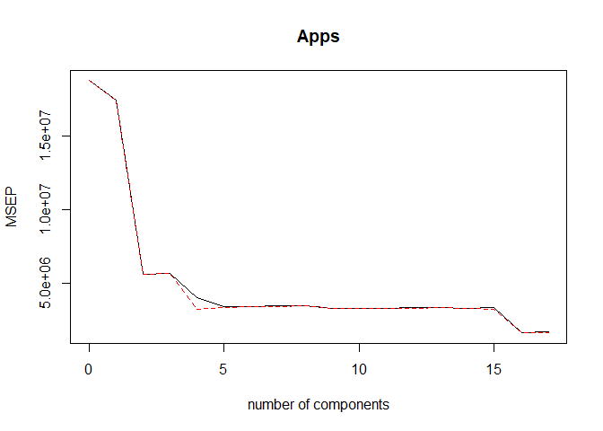
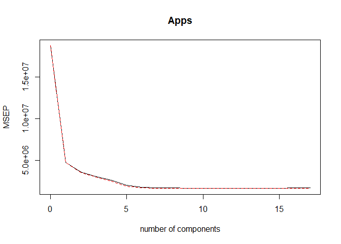
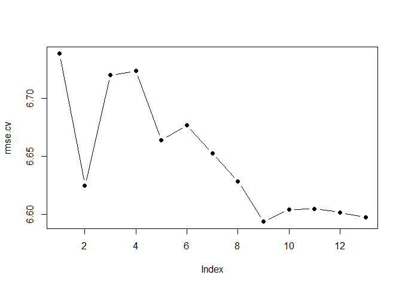
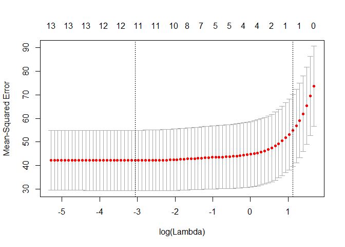
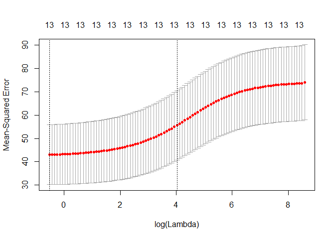

# 471 Hw2
Kaylee Sarna  
February 27, 2018  

##Set-up


#Chapter 5 Exercises

9.

```r
library(MASS)
Boston=Boston
write.csv(Boston, "C:/Users/kaylee/Dropbox/stat 471/Boston.csv")
summary(Boston)
```

```
      crim                zn             indus            chas        
 Min.   : 0.00632   Min.   :  0.00   Min.   : 0.46   Min.   :0.00000  
 1st Qu.: 0.08204   1st Qu.:  0.00   1st Qu.: 5.19   1st Qu.:0.00000  
 Median : 0.25651   Median :  0.00   Median : 9.69   Median :0.00000  
 Mean   : 3.61352   Mean   : 11.36   Mean   :11.14   Mean   :0.06917  
 3rd Qu.: 3.67708   3rd Qu.: 12.50   3rd Qu.:18.10   3rd Qu.:0.00000  
 Max.   :88.97620   Max.   :100.00   Max.   :27.74   Max.   :1.00000  
      nox               rm             age              dis        
 Min.   :0.3850   Min.   :3.561   Min.   :  2.90   Min.   : 1.130  
 1st Qu.:0.4490   1st Qu.:5.886   1st Qu.: 45.02   1st Qu.: 2.100  
 Median :0.5380   Median :6.208   Median : 77.50   Median : 3.207  
 Mean   :0.5547   Mean   :6.285   Mean   : 68.57   Mean   : 3.795  
 3rd Qu.:0.6240   3rd Qu.:6.623   3rd Qu.: 94.08   3rd Qu.: 5.188  
 Max.   :0.8710   Max.   :8.780   Max.   :100.00   Max.   :12.127  
      rad              tax           ptratio          black       
 Min.   : 1.000   Min.   :187.0   Min.   :12.60   Min.   :  0.32  
 1st Qu.: 4.000   1st Qu.:279.0   1st Qu.:17.40   1st Qu.:375.38  
 Median : 5.000   Median :330.0   Median :19.05   Median :391.44  
 Mean   : 9.549   Mean   :408.2   Mean   :18.46   Mean   :356.67  
 3rd Qu.:24.000   3rd Qu.:666.0   3rd Qu.:20.20   3rd Qu.:396.23  
 Max.   :24.000   Max.   :711.0   Max.   :22.00   Max.   :396.90  
     lstat            medv      
 Min.   : 1.73   Min.   : 5.00  
 1st Qu.: 6.95   1st Qu.:17.02  
 Median :11.36   Median :21.20  
 Mean   :12.65   Mean   :22.53  
 3rd Qu.:16.95   3rd Qu.:25.00  
 Max.   :37.97   Max.   :50.00  
```

9.a. The estimate for the population mean of medv(median value of owner-occupied homes) is about 22.53(in $1000s).

```r
#Estimate mean of medv for population(do this to Boston dataset)
mean(Boston$medv)
```

```
[1] 22.53281
```

9.b. The estimate of the standard error is about 0.409.The larger this number is the more likely the accuracy of the predictions is not good. This number is fairly small so more likely accurate.

```r
#We divide standard deviation of Boston medv by square root of observations(506) in Boston dataset
attach(Boston)
sd(medv)/sqrt(length(medv))
```

```
[1] 0.4088611
```

9.c. The standard error of the sample mean using bootstrap is about 0.412. This is pretty close to the value of 0.409 but is a little higher.

```r
#Use bootstrap to estimate standard error of the sample mean.
set.seed(1)
boot.fn = function(data, index)
 + return(mean(data[index]))
library(boot)
```

```
Warning: package 'boot' was built under R version 3.4.3
```

```

Attaching package: 'boot'
```

```
The following object is masked from 'package:car':

    logit
```

```
The following object is masked from 'package:mosaic':

    logit
```

```
The following object is masked from 'package:lattice':

    melanoma
```

```r
boot(medv, boot.fn, 1000)
```

```

ORDINARY NONPARAMETRIC BOOTSTRAP


Call:
boot(data = medv, statistic = boot.fn, R = 1000)


Bootstrap Statistics :
    original      bias    std. error
t1* 22.53281 0.008517589   0.4119374
```

9.d. The results of the C.I. for the t.test and the bootstrap are basically very similar. 21.71 to 21.73 for bootstrap and t.test respectively. 23.36 to 23.34 for bootstrap and t.test respectively.

```r
#95% confidence interval for mean of medv
mean(medv) - 2 * 0.412
```

```
[1] 21.70881
```

```r
mean(medv) + 2 * 0.412
```

```
[1] 23.35681
```

```r
#Results are 21.71,23.36
#t.test for medv
t.test(medv)
```

```

	One Sample t-test

data:  medv
t = 55.111, df = 505, p-value < 2.2e-16
alternative hypothesis: true mean is not equal to 0
95 percent confidence interval:
 21.72953 23.33608
sample estimates:
mean of x 
 22.53281 
```

9.e.The median value estimate for the population is 21.2.

```r
#Median value of medv in population
median(medv)
```

```
[1] 21.2
```

9.f.The median is 21.2 when using bootstrap. The standard error is about 0.38.This is fairly small.

```r
#standard error of the median using bootstrap
set.seed(1)
boot.fn = function(data, index) return(median(data[index]))
boot(medv, boot.fn, 1000)
```

```

ORDINARY NONPARAMETRIC BOOTSTRAP


Call:
boot(data = medv, statistic = boot.fn, R = 1000)


Bootstrap Statistics :
    original   bias    std. error
t1*     21.2 -0.01615   0.3801002
```

9.g.An estimate for the 10th percentile of medv is 12.75.

```r
#10th percentile of median medv
quantile(medv, c(0.1))
```

```
  10% 
12.75 
```

9.h.The bootstrap estimates the 10th percentile to be 12.75 with a standard error of 0.505. This standard error is fairly small compared to the percentile value.

```r
#Bootstrap to estimate standard error of 10th percentile
set.seed(1)
boot.fn=function(data, index) return(quantile(data[index], c(0.1)))
boot(medv, boot.fn, 1000)
```

```

ORDINARY NONPARAMETRIC BOOTSTRAP


Call:
boot(data = medv, statistic = boot.fn, R = 1000)


Bootstrap Statistics :
    original  bias    std. error
t1*    12.75 0.01005    0.505056
```


#Chapter 6 exercises

9.

```r
library(MASS)
College = College
write.csv(College, "C:/Users/kaylee/Dropbox/stat 471/College.csv")
summary(College)
```

```
 Private        Apps           Accept          Enroll       Top10perc    
 No :212   Min.   :   81   Min.   :   72   Min.   :  35   Min.   : 1.00  
 Yes:565   1st Qu.:  776   1st Qu.:  604   1st Qu.: 242   1st Qu.:15.00  
           Median : 1558   Median : 1110   Median : 434   Median :23.00  
           Mean   : 3002   Mean   : 2019   Mean   : 780   Mean   :27.56  
           3rd Qu.: 3624   3rd Qu.: 2424   3rd Qu.: 902   3rd Qu.:35.00  
           Max.   :48094   Max.   :26330   Max.   :6392   Max.   :96.00  
   Top25perc      F.Undergrad     P.Undergrad         Outstate    
 Min.   :  9.0   Min.   :  139   Min.   :    1.0   Min.   : 2340  
 1st Qu.: 41.0   1st Qu.:  992   1st Qu.:   95.0   1st Qu.: 7320  
 Median : 54.0   Median : 1707   Median :  353.0   Median : 9990  
 Mean   : 55.8   Mean   : 3700   Mean   :  855.3   Mean   :10441  
 3rd Qu.: 69.0   3rd Qu.: 4005   3rd Qu.:  967.0   3rd Qu.:12925  
 Max.   :100.0   Max.   :31643   Max.   :21836.0   Max.   :21700  
   Room.Board       Books           Personal         PhD        
 Min.   :1780   Min.   :  96.0   Min.   : 250   Min.   :  8.00  
 1st Qu.:3597   1st Qu.: 470.0   1st Qu.: 850   1st Qu.: 62.00  
 Median :4200   Median : 500.0   Median :1200   Median : 75.00  
 Mean   :4358   Mean   : 549.4   Mean   :1341   Mean   : 72.66  
 3rd Qu.:5050   3rd Qu.: 600.0   3rd Qu.:1700   3rd Qu.: 85.00  
 Max.   :8124   Max.   :2340.0   Max.   :6800   Max.   :103.00  
    Terminal       S.F.Ratio      perc.alumni        Expend     
 Min.   : 24.0   Min.   : 2.50   Min.   : 0.00   Min.   : 3186  
 1st Qu.: 71.0   1st Qu.:11.50   1st Qu.:13.00   1st Qu.: 6751  
 Median : 82.0   Median :13.60   Median :21.00   Median : 8377  
 Mean   : 79.7   Mean   :14.09   Mean   :22.74   Mean   : 9660  
 3rd Qu.: 92.0   3rd Qu.:16.50   3rd Qu.:31.00   3rd Qu.:10830  
 Max.   :100.0   Max.   :39.80   Max.   :64.00   Max.   :56233  
   Grad.Rate     
 Min.   : 10.00  
 1st Qu.: 53.00  
 Median : 65.00  
 Mean   : 65.46  
 3rd Qu.: 78.00  
 Max.   :118.00  
```

9.a.I split the data into training and test sets.

```r
#Split into training and test set
set.seed(1)
train=sample (1: nrow(College), nrow(College)/2)
test=-train
traincol = College[train, ]
testcol = College[test, ]
```

9.b. A linear model was fit on the training set and the test error ended up being 1108531.

```r
#Linear model using least squares on training set
lmappmodel = lm(Apps~., data=traincol)
model1pred = predict(lmappmodel, testcol)
mean((testcol[, "Apps"] - model1pred)^2)
```

```
[1] 1108531
```

```r
summary(lmappmodel)
```

```

Call:
lm(formula = Apps ~ ., data = traincol)

Residuals:
    Min      1Q  Median      3Q     Max 
-5276.1  -473.2   -63.9   351.9  6574.0 

Coefficients:
              Estimate Std. Error t value Pr(>|t|)    
(Intercept)   78.15204  600.84427   0.130 0.896581    
PrivateYes  -757.22843  205.47577  -3.685 0.000263 ***
Accept         1.67981    0.05196  32.329  < 2e-16 ***
Enroll        -0.62380    0.27629  -2.258 0.024544 *  
Top10perc     67.45654    8.45231   7.981 1.84e-14 ***
Top25perc    -22.37500    6.57093  -3.405 0.000734 ***
F.Undergrad   -0.06126    0.05468  -1.120 0.263258    
P.Undergrad    0.04745    0.06248   0.760 0.448024    
Outstate      -0.09227    0.02889  -3.194 0.001524 ** 
Room.Board     0.24513    0.07300   3.358 0.000867 ***
Books          0.09086    0.36826   0.247 0.805254    
Personal       0.05886    0.09260   0.636 0.525455    
PhD           -8.89027    7.20890  -1.233 0.218271    
Terminal      -1.71947    8.22589  -0.209 0.834539    
S.F.Ratio     -5.75201   21.32871  -0.270 0.787554    
perc.alumni   -1.46681    6.28702  -0.233 0.815652    
Expend         0.03487    0.01928   1.808 0.071361 .  
Grad.Rate      7.57567    4.69602   1.613 0.107551    
---
Signif. codes:  0 '***' 0.001 '**' 0.01 '*' 0.05 '.' 0.1 ' ' 1

Residual standard error: 1087 on 370 degrees of freedom
Multiple R-squared:  0.9397,	Adjusted R-squared:  0.9369 
F-statistic: 339.3 on 17 and 370 DF,  p-value: < 2.2e-16
```

9.c.The lambda that results in the smallest cross-validation error is 0.01149757.The test error that results is 1108512. This is with set.seed(1).

```r
#Ridge regression model fit
library(glmnet)
```

```
Warning: package 'glmnet' was built under R version 3.4.3
```

```
Loading required package: foreach
```

```
Warning: package 'foreach' was built under R version 3.4.3
```

```

Attaching package: 'foreach'
```

```
The following objects are masked from 'package:purrr':

    accumulate, when
```

```
Loaded glmnet 2.0-13
```

```r
#Set up x and y
x = model.matrix(Apps~., data=traincol)
y = model.matrix(Apps~., data=testcol)
grid = 10 ^ seq(4, -2, length=100)
mod.ridge = cv.glmnet(x, traincol[, "Apps"], alpha=0, lambda=grid, thresh=1e-12)
bestlam = mod.ridge$lambda.min
bestlam
```

```
[1] 0.01149757
```

```r
summary(mod.ridge)
```

```
           Length Class  Mode     
lambda     99     -none- numeric  
cvm        99     -none- numeric  
cvsd       99     -none- numeric  
cvup       99     -none- numeric  
cvlo       99     -none- numeric  
nzero      99     -none- numeric  
name        1     -none- character
glmnet.fit 12     elnet  list     
lambda.min  1     -none- numeric  
lambda.1se  1     -none- numeric  
```

```r
#Predict on test data
ridge.pred = predict(mod.ridge, newx=y, s=bestlam)
mean((testcol[, "Apps"] - ridge.pred)^2)
```

```
[1] 1108512
```

9.d.The lambda that was chosen is 28.48 and the test error was 1028718.The coefficients are in the coefficents output below and most are negative numbers.14 coefficients are non-zero.

```r
#Lasso model with lambda chosen by cross-validation
lasso.mod = cv.glmnet(x, traincol[, "Apps"], alpha=1, lambda=grid, thresh=1e-12)
bestlam = lasso.mod$lambda.min
bestlam
```

```
[1] 28.48036
```

```r
summary(lasso.mod)
```

```
           Length Class  Mode     
lambda     99     -none- numeric  
cvm        99     -none- numeric  
cvsd       99     -none- numeric  
cvup       99     -none- numeric  
cvlo       99     -none- numeric  
nzero      99     -none- numeric  
name        1     -none- character
glmnet.fit 12     elnet  list     
lambda.min  1     -none- numeric  
lambda.1se  1     -none- numeric  
```

```r
#Predict on test data
predlasso = predict(lasso.mod, newx=y, s=bestlam)
mean((testcol[, "Apps"] - predlasso)^2)
```

```
[1] 1028718
```

```r
#Coefficients
lasso = glmnet(model.matrix(Apps~., data=College), College[, "Apps"], alpha=1)
predict(lasso, s=bestlam, type="coefficients")
```

```
19 x 1 sparse Matrix of class "dgCMatrix"
                        1
(Intercept) -6.491800e+02
(Intercept)  .           
PrivateYes  -3.910803e+02
Accept       1.414561e+00
Enroll      -6.880133e-02
Top10perc    2.975286e+01
Top25perc   -5.898729e-03
F.Undergrad  .           
P.Undergrad  8.118367e-03
Outstate    -4.802638e-02
Room.Board   1.154551e-01
Books        .           
Personal     .           
PhD         -4.573050e+00
Terminal    -3.263399e+00
S.F.Ratio    5.152699e-01
perc.alumni -1.066814e+00
Expend       6.615233e-02
Grad.Rate    4.204566e+00
```

9.e.The test error is 1505718 for the PCR model. The M is 10 because that is the lowest cross-validation error.

```r
#PCR model with cross-validation chosen M
library(pls)
```

```
Warning: package 'pls' was built under R version 3.4.3
```

```

Attaching package: 'pls'
```

```
The following object is masked from 'package:stats':

    loadings
```

```r
set.seed(1)
pcr.fit = pcr(Apps~., data=traincol, scale=T, validation="CV")
validationplot(pcr.fit, val.type="MSEP")
```

<!-- -->

```r
summary(pcr.fit)
```

```
Data: 	X dimension: 388 17 
	Y dimension: 388 1
Fit method: svdpc
Number of components considered: 17

VALIDATION: RMSEP
Cross-validated using 10 random segments.
       (Intercept)  1 comps  2 comps  3 comps  4 comps  5 comps  6 comps
CV            4335     4179     2364     2374     1996     1844     1845
adjCV         4335     4182     2360     2374     1788     1831     1838
       7 comps  8 comps  9 comps  10 comps  11 comps  12 comps  13 comps
CV        1850     1863     1809      1809      1812      1815      1825
adjCV     1844     1857     1801      1800      1804      1808      1817
       14 comps  15 comps  16 comps  17 comps
CV         1810      1823      1273      1281
adjCV      1806      1789      1260      1268

TRAINING: % variance explained
      1 comps  2 comps  3 comps  4 comps  5 comps  6 comps  7 comps
X      31.216    57.68    64.73    70.55    76.33    81.30    85.01
Apps    6.976    71.47    71.58    83.32    83.44    83.45    83.46
      8 comps  9 comps  10 comps  11 comps  12 comps  13 comps  14 comps
X       88.40    91.16     93.36     95.38     96.94     97.96     98.76
Apps    83.47    84.53     84.86     84.98     84.98     84.99     85.24
      15 comps  16 comps  17 comps
X        99.40     99.87    100.00
Apps     90.87     93.93     93.97
```

```r
#Compute test error
pcr.pred = predict(pcr.fit, testcol, ncomp=10)
mean((testcol[, "Apps"] - data.frame(pcr.pred))^2)
```

```
[1] 1505718
```

9.f.The  M is 10 because it has the lowest cross-validation error.The test error is 1134531.

```r
#PLS model with cross-validation chosen M
pls.model = plsr(Apps~., data=traincol, scale=T, validation="CV")
validationplot(pls.model, val.type="MSEP")
```

<!-- -->

```r
summary(pls.model)
```

```
Data: 	X dimension: 388 17 
	Y dimension: 388 1
Fit method: kernelpls
Number of components considered: 17

VALIDATION: RMSEP
Cross-validated using 10 random segments.
       (Intercept)  1 comps  2 comps  3 comps  4 comps  5 comps  6 comps
CV            4335     2176     1888     1734     1605     1400     1311
adjCV         4335     2171     1882     1724     1571     1373     1295
       7 comps  8 comps  9 comps  10 comps  11 comps  12 comps  13 comps
CV        1297     1287     1278      1278      1277      1281      1281
adjCV     1281     1273     1265      1265      1264      1267      1268
       14 comps  15 comps  16 comps  17 comps
CV         1283      1284      1285      1285
adjCV      1270      1271      1271      1272

TRAINING: % variance explained
      1 comps  2 comps  3 comps  4 comps  5 comps  6 comps  7 comps
X       26.91    43.08    63.26    65.16    68.50    73.75    76.10
Apps    76.64    83.93    87.14    91.90    93.49    93.85    93.91
      8 comps  9 comps  10 comps  11 comps  12 comps  13 comps  14 comps
X       79.03    81.76     85.41     89.03     91.38     93.31     95.43
Apps    93.94    93.96     93.96     93.96     93.97     93.97     93.97
      15 comps  16 comps  17 comps
X        97.41     98.78    100.00
Apps     93.97     93.97     93.97
```

```r
#predict test error.
pls.pred = predict(pls.model, testcol, ncomp=10)
mean((testcol[, "Apps"] - data.frame(pls.pred))^2)
```

```
[1] 1134531
```

9.g.The test errors were fairly similar in each of the model types. OLS and Ridge had the closest similar test errors with 1108531 and 1108512 respectively. Lasso and PLS were a little lower and higher than those two respectively with 1028718 and 1134531 test errors. The PCR test error was the most different from the other models with 1505718 being around 400 units higher.I looked at test R^2 for the models to see with how much accuracy predictions for college applications could be made.OLS,ridge, lasso, and pls all had higher accuracy being at or above 0.9(0.94,0.90,0.91,0.90 respectively). PCR accuracy was the lowest at 0.87. These are all fairly high accuracy numbers though.We can accurately predict the number of applications in the 0.9/90% range based on all the models' r^2 values.

```r
#Calculate R^2 for determining accuracy in predicting
avg = mean(testcol[, "Apps"])
ridger2 = 1 - mean((testcol[, "Apps"] - ridge.pred)^2) /mean((testcol[, "Apps"] - avg)^2)
lassor2 = 1 - mean((testcol[, "Apps"] - predlasso)^2) /mean((testcol[, "Apps"] - avg)^2)
pcrr2 = 1 - mean((testcol[, "Apps"] - data.frame(pcr.pred))^2) /mean((testcol[, "Apps"] - avg)^2)
plsr2 = 1 - mean((testcol[, "Apps"] - data.frame(pls.pred))^2) /mean((testcol[, "Apps"] - avg)^2)

c(ridger2,lassor2,pcrr2,plsr2)
```

```
[1] 0.9010700 0.9081912 0.8656210 0.8987478
```


11.
11.a. I made models using best subsets, lasso, ridge regression, and PCR.In the best subsets models the one that is best is the 9 variable model.6.59 is the cross-validated mean squared error for the best subsets model.Most of the coefficient estimates are zero in the Lasso model. The cross-validated  RMSE is 7.42 which is higher than the best subsets.There is no variable selection in the ridge regression model because none of the coefficients are zero. The cross-validated RMSE is 7.61.In the PCR model the model with the best/lowest CV/adjCV has 13 components and the cross-validated RMSE was 6.54.These are the various models that were explored.

```r
#Best subsets
set.seed(1)
sum(is.na(Boston$crim))
```

```
[1] 0
```

```r
predict.regsubsets = function(object, newdata, id, ...) {
    form = as.formula(object$call[[2]])
    mat = model.matrix(form, newdata)
    coefi = coef(object, id = id)
    mat[, names(coefi)] %*% coefi
}

k = 10
p = ncol(Boston) - 1
folds = sample(rep(1:k, length = nrow(Boston)))
cv.errors = matrix(NA, k, p)
for (i in 1:k) {
    best.fit = regsubsets(crim ~ ., data = Boston[folds != i, ], nvmax = p)
    for (j in 1:p) {
        pred = predict(best.fit, Boston[folds == i, ], id = j)
        cv.errors[i, j] = mean((Boston$crim[folds == i] - pred)^2)
    }
}
rmse.cv = sqrt(apply(cv.errors, 2, mean))
plot(rmse.cv, pch = 19, type = "b")
```

<!-- -->

```r
which.min(rmse.cv)
```

```
[1] 9
```

```r
rmse.cv[which.min(rmse.cv)]
```

```
[1] 6.593396
```


```r
#Lasso model
mod.mat = model.matrix(crim ~ . - 1, data = Boston)
crimmod= Boston$crim
lassocv = cv.glmnet(mod.mat, crimmod, type.measure = "mse")
plot(lassocv)
```

<!-- -->

```r
coef(lassocv)
```

```
14 x 1 sparse Matrix of class "dgCMatrix"
                    1
(Intercept) 1.0894283
zn          .        
indus       .        
chas        .        
nox         .        
rm          .        
age         .        
dis         .        
rad         0.2643196
tax         .        
ptratio     .        
black       .        
lstat       .        
medv        .        
```

```r
sqrt(lassocv$cvm[lassocv$lambda == lassocv$lambda.1se])
```

```
[1] 7.405176
```


```r
#Ridge Regression model
x = model.matrix(crim ~ . - 1, data = Boston)
y = Boston$crim
ridgecv2 = cv.glmnet(x, y, type.measure = "mse", alpha = 0)
plot(ridgecv2)
```

<!-- -->

```r
coef(ridgecv2)
```

```
14 x 1 sparse Matrix of class "dgCMatrix"
                       1
(Intercept)  1.017516864
zn          -0.002805664
indus        0.034405928
chas        -0.225250602
nox          2.249887499
rm          -0.162546004
age          0.007343331
dis         -0.114928730
rad          0.059813844
tax          0.002659110
ptratio      0.086423005
black       -0.003342067
lstat        0.044495213
medv        -0.029124577
```

```r
sqrt(ridgecv2$cvm[ridgecv2$lambda == ridgecv2$lambda.1se])
```

```
[1] 7.456946
```


```r
#PCR model
pcr.fit2 = pcr(crim ~ ., data = Boston, scale = TRUE, validation = "CV")
summary(pcr.fit2)
```

```
Data: 	X dimension: 506 13 
	Y dimension: 506 1
Fit method: svdpc
Number of components considered: 13

VALIDATION: RMSEP
Cross-validated using 10 random segments.
       (Intercept)  1 comps  2 comps  3 comps  4 comps  5 comps  6 comps
CV            8.61    7.170    7.163    6.733    6.728    6.740    6.765
adjCV         8.61    7.169    7.162    6.730    6.723    6.737    6.760
       7 comps  8 comps  9 comps  10 comps  11 comps  12 comps  13 comps
CV       6.760    6.634    6.652     6.642     6.652     6.607     6.546
adjCV    6.754    6.628    6.644     6.635     6.643     6.598     6.536

TRAINING: % variance explained
      1 comps  2 comps  3 comps  4 comps  5 comps  6 comps  7 comps
X       47.70    60.36    69.67    76.45    82.99    88.00    91.14
crim    30.69    30.87    39.27    39.61    39.61    39.86    40.14
      8 comps  9 comps  10 comps  11 comps  12 comps  13 comps
X       93.45    95.40     97.04     98.46     99.52     100.0
crim    42.47    42.55     42.78     43.04     44.13      45.4
```

11.b. The model that seemed the best out of the various methods would be the best subsets model. One reason is because it has a better cross-validated RMSE than the Lasso or Ridge models(Best subset:6.59, Lasso:7.42, Ridge:7.61) due to its being smaller.The PCR model had a better cross-validated RMSE than the best subset(6.54 vs. 6.59) but there were many more variables in this model(13 to the 9 in best subsets). In a model, simplicity and less variables is preferred. So this made me conclude that the best subsets model was the best model in this situation and seemed to perform well.These were all evaluated using cross-validation mean squared errors.

11.c.My chosen model(the best subsets model) does not involve all the features of the dataset.It only includes 9 parameters/variables from the dataset. This was chosen because it had the lowest cross-validated RMSE besides the PCR model. But the PCR model was more complex with 13 components. Model simplicity is preferred when the two RMSE's are so similar. That is why some features from the dataset are missing because it results in a better predictive model.

Chapter 7 problems(Ch.7 exercise 9) moved to Hw 3 according to email.
